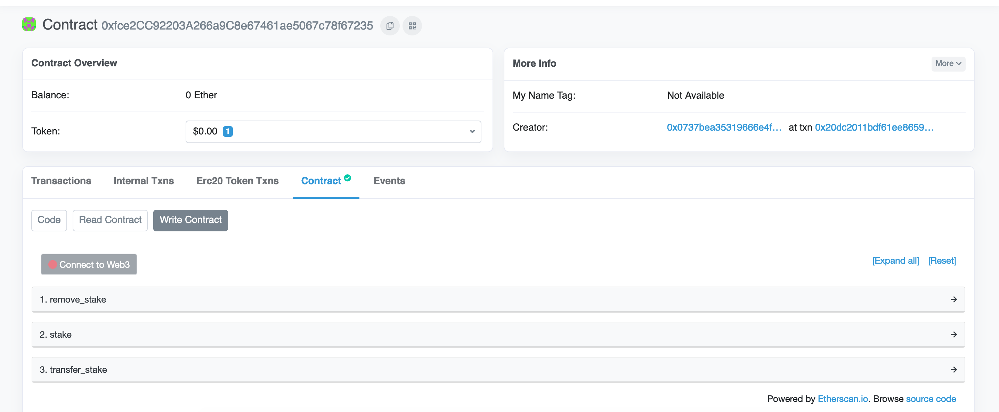
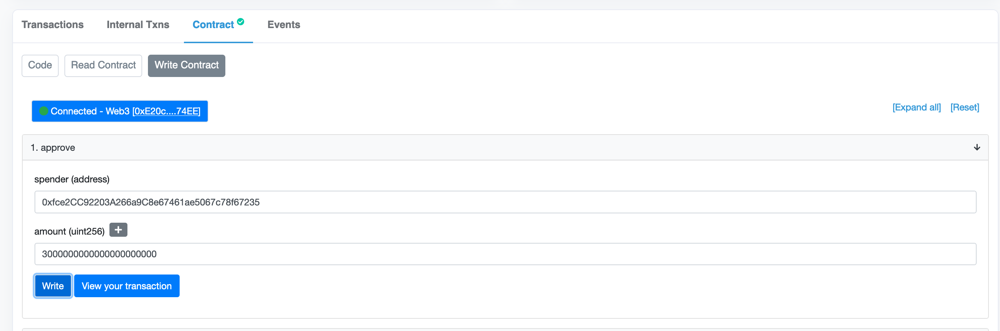
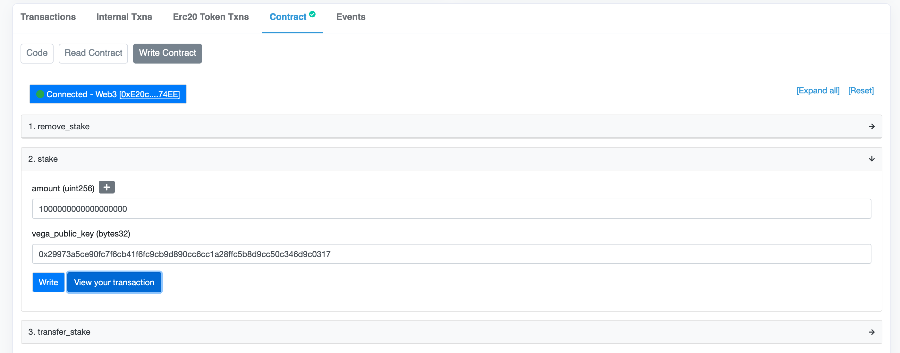

# end to end staking for validators

This guide will help you go through the following steps:
- Associate stake with your vega public key
- Nominate your node
- Withdraw the token received as staking rewards

We will be using the vega command line to submit transaction to the vega network but also
etherscan to submit transaction to the ethereum network.

Each network folders contains a file smart-contract.json. These file contains map of contract name to ethereum address.
Each time we will transact with an ethereum contract, make sure to use the address related to the network you are using, as this
guide is compatible for any vega network.

Also make sure that you are using the right etherscan link when execution ethereum contracts:
- ropsten (vega testnets) -> https://ropsten.etherscan.io/
- mainnet (vega mainnet)  -> https://etherscan.io/

Finally when we interaction with an ethereum contract, go to the appropriate etherscan, submit the contract address in the
search form, then select `Contract`, and then `Write` and finally select `Connect to web3` which will allow you to connect
to one of wallet provider for ethereum.
<p align="center">
    
</p>


### Associate stake with your vega public key.

#### Locate your vega pubkey
Locate your vega public key, it is a 64 character long hexadecimal string. you can find it in the genesis file for example:
```
    "validators": {
      "y2iL4RlqFQvC8wAgU8pv4ge5XlYDvxmnKUx9/GkR9Ho=": {
        "id": "bbf0705fc8b82a9205f4cce1ce0d35f208cdfd5bc42df3c533fc209d8788c900",
        "vega_pub_key": "99f391c2299ea293ee0379d79635b143c53a75891784ea304300b9269db29269", <--------- This value
        "ethereum_address": "0x59eAf83cd47dDeF6F4627383a0EDa9f70D5f6Dcb",
        "tm_pub_key": "y2iL4RlqFQvC8wAgU8pv4ge5XlYDvxmnKUx9/GkR9Ho=",
        "info_url": "https://nodes.guru/",
        "country": "RU",
        "name": "Nodes Guru",
        "avatar_url": ""
      },
	}
```


#### Approve token spending with the staking bridge
Then open the token contract on etherscan, and select the approve method, in the `spender` field use the `staking_bridge` address as input
And in the `amount` field select an amount big enough to cover the amount of stake you wish to deposit, the following screenshot is an example
of running this transaction for an approval of 3K VEGA token on testnet.
<p align="center">
    
</p>


#### Deposit your token on the staking bridge
Now we open the `staking_bridge` contract on etherscan and select the `stake` method (on the `vesting_contract` available on mainnet, this method is called
`stake_deposit`). Inside the amount field we input the amount to be associated with your vega pub key, and in the vega_pub_key we use the pubkey we identified
earlier prefixed with `0x`.
<p align="center">
    
</p>

Once this transaction have been executed and the number of confirmation required by the vega network has been reached, your staking balance should be
available in the vega network. You can confirm this by calling either this endpoint on the vega node:
```
curl http://VEGA_NODE_ADDRESS:REST_PORT/parties/stake?party=YOUR_VEGA_PUB_KEY
```
or the following endpoint on the data node:
```
curl http://DATA_NODE_ADDRESS:REST_PORT/parties/YOUR_VEGA_PUB_KEY/stake
```

You should see a similar payload to the following:
```
{
  "partiesStake": [
    {
      "party": "29973a5ce90fc7f6cb41f6fc9cb9d890cc6cc1a28ffc5b8d9cc50c346d9c0317",
      "currentStakeAvailable": "5000000000000000000",
      "stakeLinkings": [
        {
          "id": "b8250df43b03d9cb7d29655e154f101423a937142cbc35befddfec0a70c2fdf2",
          "type": "TYPE_LINK",
          "ts": "1636134806",
          "party": "29973a5ce90fc7f6cb41f6fc9cb9d890cc6cc1a28ffc5b8d9cc50c346d9c0317",
          "amount": "5000000000000000000",
          "status": "STATUS_ACCEPTED",
          "finalizedAt": "1636448668080479533",
          "txHash": "0x54a7f46595ef37a65b5f2c09d9888c7210ce8cb5a9a0df7dd36a61f5f51d1e93"
        }
      ]
    }
  ]
}
```

> note the number of confirmation is set to 50, expect a ~12 minutes delay until 50 block are being processed in ethereum so the vega network update your balances.


### Nominate a node

This part of the guide will be done using the vega wallet. We assume here that the vega wallet used by your node has been created following
the [isolated vega wallet guide](https://github.com/vegaprotocol/networks/blob/master/isolated-vega-wallets.md), and that the isolated wallet in use
is available in your default wallet path.
